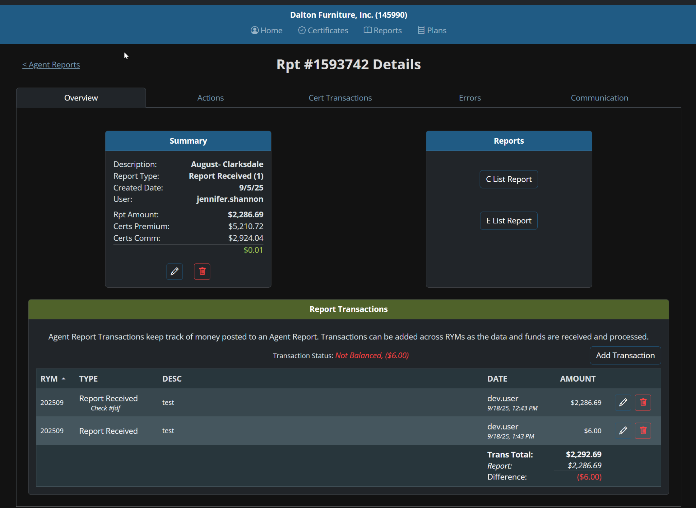
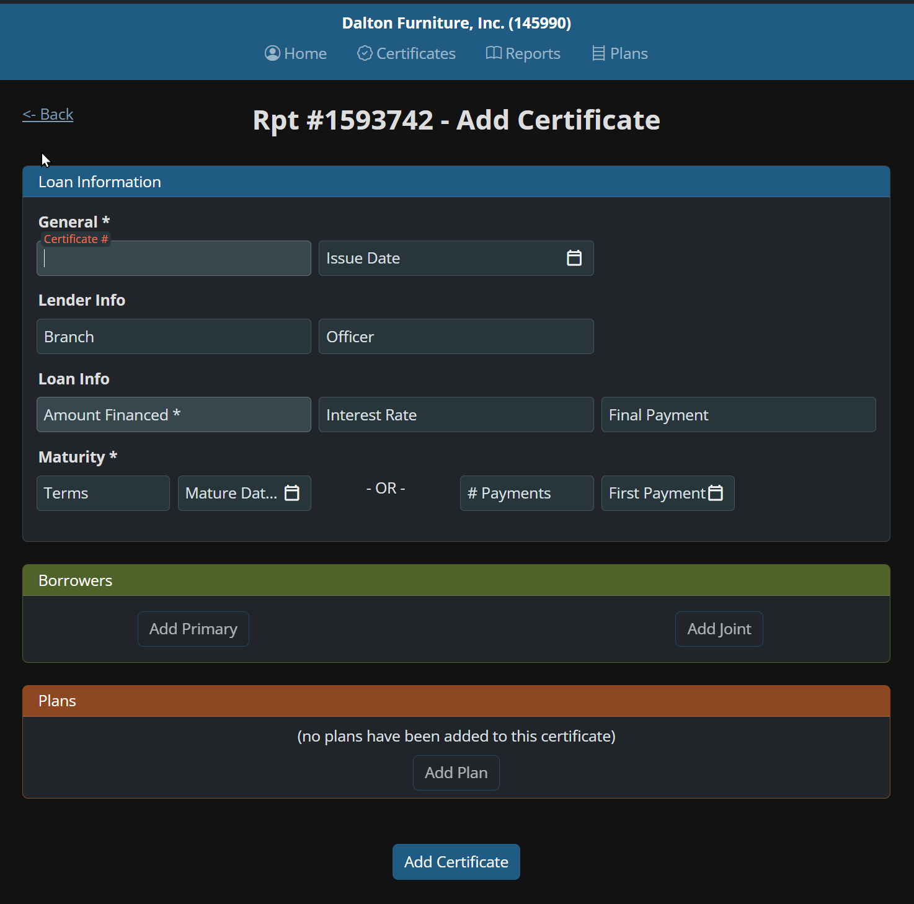
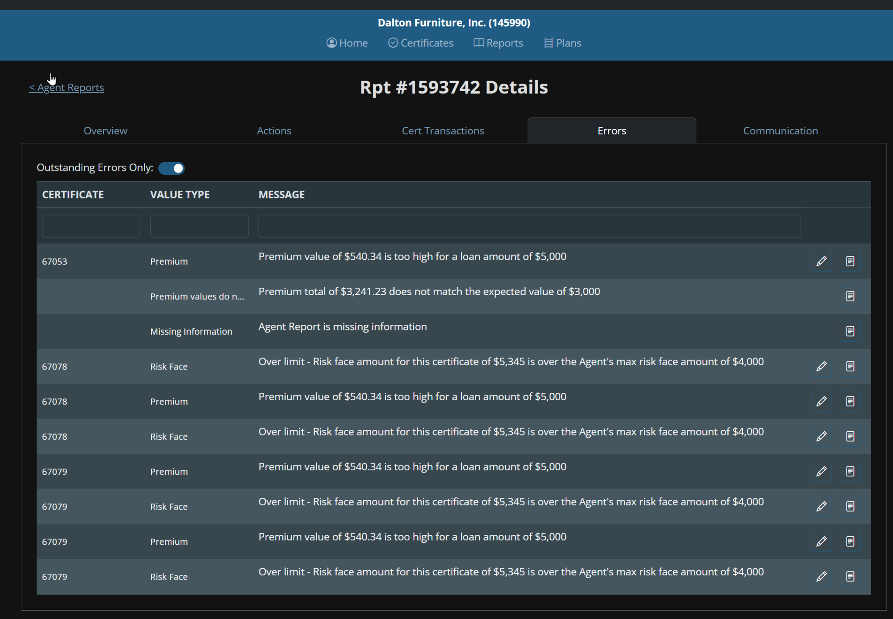
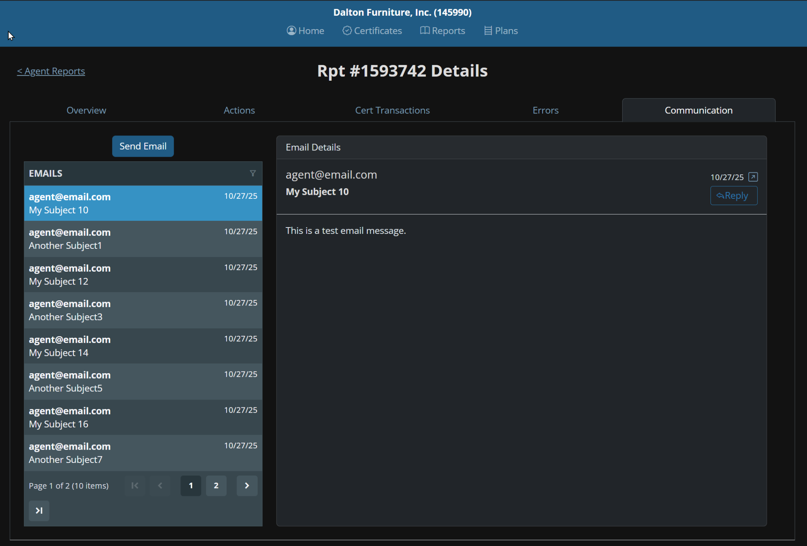
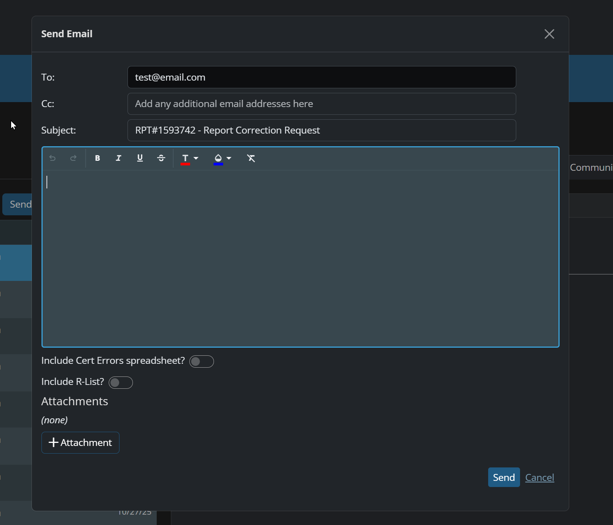

# TransCredit - Complete Project Documentation

## 📋 Table of Contents

1. [Business Context](#business-context)
2. [Business Processes](#business-processes)
3. [System Analysis (As Is)](#system-analysis-as-is)
4. [To Be (Desired State)](#to-be-desired-state)

---

## 🏢 Business Context

### Industry Background
**Plateau Group** operates within the **credit insurance industry**, specifically managing **credit life and disability insurance** sold through banking channels. This type of insurance protects borrowers and their families in case of death or disability, ensuring loan repayment.

**TransCredit** is the internal system used by Plateau Group to process monthly reports from financial institution agents and manage certificate data.

### Business Model: How Insurance Works with Agents

#### Who are Agents in Plateau Group Context
**Agents** in this context are **financial institutions** (including banks, credit unions, and other lending organizations) that sell credit insurance to their customers when they take out loans. These are not individual insurance agents, but rather **institutions** that have agreements with Plateau Group to offer credit insurance products to their loan customers.

#### How the Insurance Business Works
1. **Customer takes a loan** from a financial institution (agent)
2. **Institution offers credit insurance** to protect the loan in case of death or disability
3. **Customer purchases insurance** as part of their loan package
4. **Institution collects premium** from customer along with loan payments
5. **Institution submits monthly reports** to Plateau Group with all insurance sales
6. **Plateau Group processes** the insurance certificates and manages the policies

#### Where TransCredit Fits In
**TransCredit** is the **internal processing system** used by Plateau Group to handle the monthly reports from financial institution agents. It's the system that Plateau Group uses to:
- **Receive monthly sales reports** from financial institutions showing all insurance sold
- **Process certificate data** for each insurance policy
- **Validate and correct errors** in the data submitted by institutions
- **Manage financial reconciliation** between what institutions sold and what they owe
- **Handle agent communication** when errors need to be corrected

### Current System Scope
The **TransCredit system** (used by Plateau Group) handles:
- **Monthly Sales Reports** from financial institution agents containing certificate data
- **Certificate Processing** including data entry, validation, and error correction
- **Financial Balancing** between agent reports and premium remittances
- **Agent Communication** for error resolution and billing adjustments
- **Compliance Management** ensuring adherence to state regulations and audit requirements

---

## 📊 Business Processes

### Current Business Process (As Is)

#### Process Diagram


#### Monthly Report Processing Workflow

Here is the detailed step-by-step process:

#### 1. **Receive Monthly Sales Report**
Banks and credit unions send monthly reports showing how many insurance policies they sold. The report contains: who bought insurance, how much they paid, what health information they provided. It also shows how much money the bank owes Plateau Group for the sold insurance policies.

#### 2. **Assign Report Number and Description**
Staff member logs into TransCredit system, creates a new report record and assigns it a number. The staff member gives the report an internal name based on how it was received:

- **Manual processing**: "August Bath" (month + city where bank is located)
- **Electronic payment**: "August ER" (month + "ER" for e-remit system)
- **Website upload**: "August Upload" (month + "Upload" for website submission)

This internal naming helps staff immediately identify how each report was received and processed.

#### 3. **Enter Certificate Information into TransCredit System**
Staff member enters data for each insurance certificate into the system. If a certificate has no number (bank's printing problem), they use the last 4 digits of SSN. They notify agent services about the printing issue so they can contact the bank and fix the printing problem.

**Important**: Data is entered exactly as printed, even if they know it's wrong.

#### 4. **Check Health Questions Status**
Staff member checks if the customer answered health questions and sets a system code in TransCredit:
- **Code "1"**: Health questions answered
- **Code "3"**: Health questions NOT answered (triggers system error)

For disability insurance, ALL health questions must be answered before the policy can be processed.

#### 5. **Run Snapshot Validation**
Staff member clicks "Run Snapshot" button and system checks all certificates for errors:
- Is customer too old for insurance
- Is premium calculated correctly
- Is coverage amount correct
- Is refund method correct (pro-rata or Rule 78)
- Bank platform errors
- Printing errors (extra premiums)
- Limit violations

#### 6. **Error Processing (95% of work time)**
If errors are found, the most time-consuming part begins. Staff spend 95% of time fixing errors that banks make. Errors happen because:
- Bank employee entered data incorrectly in their system
- Bank's system works incorrectly
- Bank's platform cannot help

When fixing errors:
##### 6.1 **View error list**
##### 6.2 **Enter data exactly as bank submitted (even if they know it's wrong)**
##### 6.3 **Balance to original amounts (critically important - before corrections)**
##### 6.4 **Create exception report (what they changed)**
##### 6.5 **Update system with correct amounts**
##### 6.6 **Print updated error list**
##### 6.7 **Generate billing for bank (how much they owe or get back)**
##### 6.8 **Notify bank of changes (billing + explanations + customer letters)**

#### 7. **Run Over Limits Check**
Staff member clicks "Run OLIST" button and system checks if customer exceeds coverage limits. For example, if customer already has $50,000 insurance and bank sold another $60,000, then the $100,000 limit is exceeded.

**Business Context - Multiple Policies Active:**
This process addresses the situation where a customer has multiple active insurance policies that may exceed the agent's coverage limits. Each agent (bank/credit union) has a maximum coverage limit per customer (e.g., $100,000). When a customer takes a new loan and the bank offers insurance, the system must check if the total coverage would exceed the agent's limits.

**Business Logic:**
- **Agent Coverage Limits**: Each agent has maximum coverage limits per customer
- **Multiple Policies Problem**: Customer may have existing policies from other banks
- **Exceeded Limits**: New policy + existing policies > agent's maximum limit
- **Resolution Required**: Agent must either reduce new coverage or confirm old policies are cancelled

If limit exceeded:
- **Contact bank** - is old insurance still active
- **If Multiple Policies Active = YES**: Reduce new coverage to stay within limits
- **If Multiple Policies Active = NO**: Bank can proceed with new policy
- **Notify customer of reduction** (legal requirement if coverage is reduced)
- **Bank can keep new insurance** if they cancel old one

**Practical Example:**
##### 1. **Customer John has $50,000 insurance through Bank A**
##### 2. **Takes new loan at Bank B for $80,000**
##### 3. **Bank B offers $80,000 insurance**
##### 4. **System checks: $50,000 + $80,000 = $130,000 > Bank B's $100,000 limit**
##### 5. **Bank B must either reduce insurance to $50,000 or confirm Bank A's policy is cancelled**

#### 8. **Print Report**
Print main report with financial balance.

#### 9. **Print Customer List**
Print list of all customers in the report.

#### 10. **Scan All Documents Together**
Scan all documents together for archive:
- Report
- Customer list
- All supporting documents

#### 11. **Complete Monthly Report Processing**
Monthly report processing is completed.

### Error Correction Process (Detailed)

#### Common Error Types
1. **Age Limit Violations**: Customers too old for insurance
2. **Premium Calculation Errors**: Wrong amounts calculated by agents
3. **Coverage Amount Mistakes**: Incorrect coverage amounts
4. **Refund Method Errors**: Wrong refund calculations (pro-rata vs Rule 78)
5. **Platform Provider Errors**: System issues with agent platforms
6. **Printing Errors**: Extra premiums or incorrect data
7. **Multiple Policy Violations**: Exceeding agent coverage limits

#### Error Correction Workflow
1. **Identify Errors**: Through snapshot validation
2. **Input Original Data**: Enter exactly as agent submitted
3. **Balance to Original**: Must balance to original report numbers
4. **Make Corrections**: Apply correct calculations
5. **Document Changes**: Create exception report
6. **Notify Agent**: Send billing statement and explanations
7. **Notify Customer**: If life/disability/AD&D changed (legal requirement)

---

## 🏗️ System Analysis (As Is)

### Technology Stack Overview
- **Frontend**: Excel-based interface for data input and search
- **Backend**: MS Access database with VBA code and stored procedures
- **Communication**: Email-based with no integrated tracking
- **Manual Processes**: 95% of operations require manual intervention

### Technology Used for Each Business Process Step

#### 1. Receive Monthly Sales Report
- **Technology**: Email system, physical mail, website uploads
- **Process**: Manual receipt and sorting of reports
- **Tools**: Email clients, physical mail handling, website interface

#### 2. Assign Report Number and Description
- **Technology**: MS Access database
- **Process**: Staff logs into TransCredit system, creates new report record
- **Tools**: Access forms for data entry, internal naming system

#### 3. Enter Certificate Information into TransCredit System
- **Technology**: MS Access database with Excel interface
- **Process**: Manual data entry from certificates
- **Tools**: Excel-based forms, Access database tables
- **Data Sources**: Certificate numbers, SSN (last 4 digits), customer information

#### 4. Check Health Questions Status
- **Technology**: MS Access database with VBA code
- **Process**: Staff sets system codes (1 = answered, 3 = not answered)
- **Tools**: Access forms with dropdown codes, VBA validation logic

#### 5. Run Snapshot Validation
- **Technology**: MS Access with VBA stored procedures
- **Process**: Staff clicks "Run Snapshot" button, system scans for errors
- **Tools**: Access VBA code, database queries, error checking algorithms
- **Validations**: Age limits, premium calculations, coverage amounts, refund methods

#### 6. Error Processing (95% of work time)
- **Technology**: MS Access database, Excel for calculations, Email system
- **Process**: Manual error correction and agent communication
- **Tools**: 
  - Access forms for error list viewing
  - Excel for manual calculations
  - Email clients for agent communication
  - Manual balancing and reconciliation

#### 7. Run Over Limits Check
- **Technology**: MS Access with VBA code
- **Process**: Staff clicks "Run OLIST" button, system checks coverage limits
- **Tools**: Access VBA procedures, Form ME-SPNLD-HQA (8/12)
- **Database**: Coverage limit tables, agent agreement data

#### 8. Print Report
- **Technology**: MS Access reporting, printer system
- **Process**: Generate and print financial balance report
- **Tools**: Access report generator, printer drivers

#### 9. Print Customer List
- **Technology**: MS Access reporting
- **Process**: Generate and print customer list
- **Tools**: Access report generator

#### 10. Scan All Documents Together
- **Technology**: Scanner hardware and software
- **Process**: Physical document scanning and archiving
- **Tools**: Scanner drivers, file management system

#### 11. Complete Monthly Report Processing
- **Technology**: MS Access database
- **Process**: Mark report as completed in system
- **Tools**: Access forms for status updates

### Current System Limitations
- **Payment Schedules**: System only calculates monthly payments (not bi-weekly/annual)
- **Birthday Coverage**: System assumes max 12 months, but customers can have coverage up to 71st birthday (15+ months)
- **30-Day Free Look**: System incorrectly flags full refunds within 30 days as errors
- **State Regulations**: Manual handling required for North Carolina ("net plus three") and Kentucky (county taxes)
- **Agent Platform Issues**: Wrong refund methods, printing errors, platform provider problems

### Operational Challenges
- **Manual Error Correction**: 95% of time spent on corrections
- **Limited Search Capabilities**: Basic search by certificate number, SSN, customer name
- **Inadequate Audit Trail**: High-level logging without detailed change tracking
- **Email Communication**: No integrated tracking of agent communications
- **State-Specific Rules**: Manual notes required for different state regulations

---

## 🚀 To Be (Desired State)

### Process Diagram


### MVP Phases Overview

The TransCredit MVP is structured in multiple phases to enable incremental delivery:

* **MVP Phase 1 (In Progress)**: Focuses on core certificate input, validation, and editing functionality. This phase establishes the foundation for certificate management with validation logic, versioning, and basic editing capabilities. OCR integration works automatically as a byproduct of this work.

* **MVP Phase 2 (Next Focus)**: Builds upon Phase 1 to add comprehensive error management and correction workflows. Priority order: Error Summary UI → Certificate Error Checking Service → Certificate Editing (Error Correction Flow) → Email Communication UI → Cert QA Review UI.

* **Future Phases**: Additional features such as Correction & Approval Workflow, Balancing Module enhancements, and other advanced capabilities will be addressed after core components are complete.

This phased approach allows development to proceed on Phase 1 while business requirements are being gathered for subsequent phases.

### Technology Stack (MVP)

Frontend:
* Blazor (C#) - Сore frontend framework across all projects. Must align with existing portal modules and component library.
* Razor Components / Shared UI Kit - Reuse Plateau Group’s internal component library and DMZ Bootstrap-based Blazor controls.
* Styling Consistency – Follow existing internal web portal (PlateauGroup.Web) standards, compiled via Web Compiler SCSS.

Backend:
* C# / .NET 8 API layer - Business logic, data validation, workflow, audit, and integrations.
* Microsoft SQL Server - Centralised relational DB for Certificates
* Entity Framework Core - ORM for database communication.
* Plateau Services Layer – Shared API for report and remittance processing.

Deployment and Environments:
* The main repo contains both the Internal and DMZ projects.
* Daily commits → feature branches → review → merge to main (repo shared with Plateau team).
* Plateau executes the final merge and deployment via the existing internal pipeline.
* Standard four-tier model (Dev/Test/UAT/Prod).

Authentication / Authorisation:
* Azure Active Directory (SSO + MFA) – Confirmed as the primary auth provider for internal users.
* RBAC – Role-based access controlled by Active Directory groups (APS Admin, Operators, etc.).
* No new roles required for MVP; existing groups cover all permissions.
* Note: DMZ portal already exists and uses Auth0; not part of Phase 1 scope.

Integrations:
* DocMgmt & OCR - Existing document ingestion system with PSI scanners and AI OCR. OCR works automatically via shared components with manual certificate UI (no separate integration work needed).
* Email Service – Microsoft 365 SMTP; outbound queued in Plateau DB and processed internally. Backend code ready (Ammon finishing network services setup).
* Note: DMZ → Internal Sync not in Phase 1 scope (DMZ portal already exists).

### Feature List (MVP)

The MVP is divided into multiple phases. Phase 1 focuses on core certificate input and validation functionality, while Phase 2 adds error management and correction workflows.

#### 🟢 MVP Phase 1 (In Progress)

| Feature | Description | Est., H |
|---|---|---|
| Certificate Creation Page Completion | Finalise the existing "Add Certificate" page: ensure all required fields are functional, enable saving new certificates to the database, and run validation on save. UI is mostly complete; needs connection to DI Certificate Service and data persistence. | 12h |
| Certificate Editing | Enable full editing of certificate details. Base functionality for editing certificates. | 8h |
| Change Reason Tracking | Require users to provide a reason for any certificate change; allow selecting predefined reasons or entering a custom one. Record all certificate modifications (old/new values, reasons, user, date). | 10h |
| Certificate Versioning | Maintain version history for each certificate record. Each agent enhancement round should create a new version entry capturing the full snapshot of certificate data at the time of change. Versions can be compared to highlight differences between any two states (e.g., "before vs after" view). | 16h |
| Certificate Validation | Extend the existing validation logic (already migrated from Access) by adding remaining missing checks and enabling persistent storage of validation results in the database. Approximately 80% of checks are implemented in DI; remaining ones need to be ported from Access. Validation should run on save/update. | 8h |
| Error Storage and Management | Store validation errors in the database, track their status (open/resolved), and display them in the interface (issues tab). | 6h |
| Enhanced Certificate Search | Add extended search criteria (name, date of birth, SSN, claim number, agent) and an advanced search mode. | 8h |
| Email Integration | Implement backend tables for inbound/outbound emails and attachments; integrate with the client's email service via DB. **Symfa work (16h)**: Create DB tables for emails and attachments. **Ammon work**: Backend service that interacts with Exchange server (reads/writes to Symfa's tables) - Ammon finishing network services setup. | 16h |
| Email Communication UI | Improve the communications interface, add logic (Get Emails/Create an Email). | 8h |
| Error Export and Attachment | Allow users to export validation errors to Excel/CSV and attach them to outgoing emails. | 8h |
| OCR Ingestion Integration | OCR system already exists and works automatically via shared components with manual certificate UI. No separate work needed - will work as a byproduct of Phase 1 validation work. | Automatic byproduct |

**Note:** OCR integration works automatically because it uses the same components as the manual certificate creation page. As Phase 1 validation and controls are built, OCR will automatically benefit from the same error checks and validations.

#### 🟡 MVP Phase 2 (Next Focus - Priority Order)

**Priority 1: Start here**
| Feature | Description | Status |
|---|---|---|
| Error Summary UI | Screen for grouped certificate errors (by type, severity) with drill-down. Loads from cert error table. This is the recommended starting point for Phase 2. | UI ready; needs cert error table |

**Priority 2: High priority**
| Feature | Description | Status |
|---|---|---|
| Certificate Error Checking Service | Port remaining validation/error logic from Access/SQL into a C# service. Expand current validation error logic to include anything missing, then store information in new certificate error table. Approximately 80% of logic is done in DI Certificate Service; need to port remaining rules and add CertError table with CRUD operations. | Logic 80% done; needs table + CRUD |
| Error Storage and Management | Store and manage validation errors (open/resolved). Part of Certificate Error Checking Service - implements cert error table. | Part of Error Checking Service |

**Priority 3: After Error Summary UI**
| Feature | Description | Status |
|---|---|---|
| Certificate Editing (Error Correction Flow) | Integration with Error Summary UI to correct errors. When operators see errors, they click to open certificate edit page, make corrections, save, and errors are marked as cleared. Uses Phase 1 editing functionality. | Uses Phase 1 editing |

**Priority 4: After Editing**
| Feature | Description | Status |
|---|---|---|
| Email Communication UI | UI for reading/sending emails and linking to certificates. Includes ability to attach error spreadsheets. Currently only a demo exists; needs full implementation with DB tables. | Demo exists; needs full implementation |

**Priority 5: Testing & QA**
| Feature | Description | Status |
|---|---|---|
| Cert QA Review UI | QA review of OCR data (Pass/Fail) and promotion to APS Plateau. UI is ready; needs testing with new validation logic. | UI ready; needs testing |
| Certificate Import & Idempotency | Controlled import/update of certificates after QA Pass. Handled as part of QA Review flow. | Part of QA Review flow |

#### ⏸️ Future Phases / Later

| Feature | Description | Status |
|---|---|---|
| Correction & Approval Workflow | Side-by-side comparison (DMZ vs APS), approve/reject flow. Postponed until much later, if ever. | Postponed |
| Balancing Module | Transaction and totals reconciliation logic. Happy path works, but mismatched cases need business review with Tanya. Needs expansion. | Needs business alignment |
| Change Reason Tracking | Mandatory reason/comment when editing certificate data. Will be part of future Correction Workflow. | Future phase |
| Enhanced Certificate Search | Advanced search filters (DOB, SSN, agent, etc.). Not in current focus. | Future phase |
| Error Export and Attachment | Export errors to Excel/CSV and attach to outgoing emails. Planned later. | Future phase |

#### ✅ Already Complete / No Action Required

| Feature | Description | Status |
|---|---|---|
| DMZ Certificates Portal | External portal for agents to upload and review pending reports. | Already exists and working |
| Agent Notification | Automatic notifications to agents. | Working and complete |
| OpsLog Unification & Events | System event tracking (creation, QA, corrections, etc.). Fully implemented and reusable. | Fully implemented |
| Email Server | Microsoft 365 SMTP backend service. | Configured by Ammon |
| Email Integration (Backend Service) | Backend service code ready; Ammon finishing network services setup. This service reads/writes to DB tables that Symfa creates in Phase 1. | Ammon completing setup |

#### ⏸️ Out of Scope

| Feature | Description | Status |
|---|---|---|
| DMZ Certificate Update Forms | External forms for agents to correct certificates. Dropped - agents won't edit through DMZ. Manual handling only. | Out of scope |

### Team Composition (MVP)

| Role | Responsibility | Allocation |
|---|---|---|
| Project Manager | Client communication, scope control, prioritisation, and sprint planning. | Cross |
| Business Analyst | Process mapping, requirement detailing, backlog management, user stories, and acceptance criteria. | Cross |
| Tech Lead | Defines system architecture, integration approach, API contracts, data flow. Coordinates with Client SMEs | As needed |
| Developer FS | Builds Blazor UI, forms, dashboards, and approval screens using the existing component kit.<br>Implements APIs, workflow logic, and data access | 1 FTE |
| QA Engineer | End-to-end testing, regression, and UAT support. | As needed |

### Assumptions (MVP)

* The Certificates module will be developed inside the existing Plateau Web portal.
* The public agent-facing portal (DMZ) is not in scope for Phase 1; DMZ Certificates Portal already exists and is working.
* No new standalone web app or DB server required.
* An OCR system exists and provides structured data output. OCR integration works automatically via shared components with manual certificate UI - no separate work needed for Phase 1.
* Outbound and inbound email processing will be handled by Plateau's internal Microsoft 365 infrastructure. The Symfa team will only manage database records for email UI.
* All existing Access-based logic (snapshot checks, rule validations, and audit placeholders) can be accessed or exported for migration.
* Authentication and role management will rely on existing infrastructure: Azure AD (internal); no new identity provider is introduced.
* Document generation and storage will leverage existing ShareFile; no new PDF/letter builder will be introduced unless Plateau explicitly requests it.
* System non-functional goals (load, concurrency, RPO/RTO) are assumed to match existing Plateau web standards until defined otherwise.
* All outgoing agent communications will use Plateau's Microsoft 365 SMTP relay, routed internally for compliance.

### Risks (MVP)

* Legacy data mapping between old Access structures and the new SQL schema may require additional adjustments during migration.
* Access snapshot and validation rules are extensive and poorly documented; extracting and replicating remaining logic (approximately 20% not yet ported) may take longer than planned.
* Ownership of financial totals (which layer is authoritative) must be confirmed to prevent balancing discrepancies.
* Legally required customer letters and notifications must follow approved templates and compliance workflows; missing templates could delay production rollout.
* If dynamic template-based document generation is later requested, new infrastructure or integration effort may be required beyond the current MVP scope.
* Balancing Module happy path works, but mismatched cases need business review with Tanya to understand how to handle situations when numbers don't add up as expected.

---

*This comprehensive documentation provides a complete overview of the TransCredit project, from high-level business context to detailed system analysis and target state, ensuring all stakeholders understand the current state, challenges, and future vision.*

---

# Appendix: Prototype Overview – Complete Interface Documentation

<!-- The following content is inserted verbatim from Prototype Overview/Complete-Interface-Documentation.md -->

# TransCredit Prototype Overview - Interface Documentation

## 📋 Overview
This document contains detailed descriptions of all TransCredit prototype interfaces, demonstrating the transition from the outdated MS Access/Excel system to a modern web application with automated error processing and improved agent communication.

---

# 1. Agent Reports Overview - Detailed Interface Description

## 📋 General Information
**Mockup File**: `01-Agent-Reports-Overview.svg`  
**Functionality**: Main page for managing agent reports  
**Target Audience**: TransCredit operational staff  
**Business Process**: Processing monthly reports from financial institutions

## 🖼️ Interface Preview
  

## 🎯 Interface Purpose
This interface serves as the central management point for agent reports, replacing the current MS Access system. It allows operational staff to view, analyze, and manage financial reports from banks and credit unions.

## 🧭 Navigation Structure

### Main Navigation (Top Panel)
- **Overview** - Report overview (current page)
- **Actions** - Report actions
- **Cert** - Certificate management
- **Transactions** - Financial transactions
- **Errors** - Error management
- **Communication** - Agent communication

## 📊 Report Information Section

### Report Header
- **Report Number**: Rpt #1593742
- **Description**: "August- Clarksdale"
  - Format: [Month] - [Agent City/Location]
  - Examples: "August Bath", "August ER", "August Upload"

### Main Report Fields
| Field | Value | Description | Business Logic |
|-------|-------|-------------|----------------|
| **Report Type** | Report Received (1) C List Report | Report type | Determines report source |
| **Created Date** | 9/5/25 | Creation date | Date when staff processed the report |
| **User** | jennifer.shannon | Responsible user | Who is processing the report |
| **Rpt Amount** | $2,286.69 | Report amount | Total amount agent owes |

### Financial Metrics
| Field | Value | Description | Calculation |
|-------|-------|-------------|-------------|
| **Certs Premium** | $5,210.72 | Total certificate premiums | Sum of all insurance premiums |
| **Certs Comm** | $2,924.04 | Agent commission | Percentage of premium agent receives |
| **Difference** | $0.01 | Calculation difference | Difference between expected and actual |

## 💰 Agent Transactions Section

### Section Header
- **Title**: "Agent Report Transactions"
- **Description**: "keep track of money posted to an Agent Report. Transactions can be added across RYMs as the data and funds are received and processed."

### Balancing Status
- **Status**: "Not Balanced, ($6.00)"
- **Indicator**: Red color (presumably)
- **Value**: Negative difference of $6.00

### Action Buttons
- **Add Transaction** - Add new transaction
- **E List Report** - Export transaction list

### Transactions Table
| Column | Description | Example Value |
|--------|-------------|---------------|
| **RYM** | Reporting Year Month | 202509 |
| **TYPE** | Transaction type | Report Received |
| **DESC** | Description | dev.user |
| **DATE** | Transaction date | 9/18/25, 12:43 PM |
| **AMOUNT** | Amount | $2,286.69 |

### Financial Summary
| Metric | Value | Description |
|--------|-------|-------------|
| **Trans Total** | $2,292.69 | Total of all transactions |
| **Report** | $2,286.69 | Report amount |
| **Difference** | ($6.00) | Difference (negative) |

## 🔧 Functional Capabilities

### Main Actions
1. **View Report** - Detailed financial status information
2. **Add Transactions** - Record agent payments
3. **Balancing** - Verify amount matching
4. **Navigation** - Transition to other report sections

### Business Rules
- **Mandatory Balancing**: Report cannot be completed without balance
- **Transaction Tracking**: All monetary receipts must be recorded
- **Time Frames**: Transactions can be added throughout the month (RYM)

## 🎨 Design and UX

### Visual Elements
- **Color Scheme**: Modern web palette
- **Typography**: Clear headers and readable text
- **Spacing**: Well-structured layout

### Interactivity
- **Clickable Elements**: Navigation tabs
- **Action Buttons**: Add Transaction, E List Report
- **Status Indicators**: Visual balance display

## 🔄 Integration with Other Modules

### Related Interfaces
- **Certificates** - Transition to certificate management
- **Errors** - View report errors
- **Communication** - Contact agent regarding balance issues

### Data
- **Source**: MS Access database (current system)
- **Target**: SQL Server (new system)
- **Format**: Structured report data

## 📈 Advantages of New Interface

### Compared to Current System (MS Access)
1. **Modern Interface** - Web application instead of Access forms
2. **Improved Navigation** - Intuitive tab structure
3. **Real-time** - Instant data updates
4. **Scalability** - Multiple user support

### Business Benefits
- **Processing Speed** - Quick access to information
- **Accuracy** - Automatic calculations and validation
- **Tracking** - Complete change history
- **Collaboration** - Multiple users

## 🚀 Technical Requirements

### Frontend
- **Technology**: Blazor WebAssembly
- **Responsive**: Adaptive design
- **Accessibility**: Compliance with accessibility standards

### Backend
- **API**: RESTful services
- **Database**: SQL Server
- **Authentication**: Integrated user system

### Integrations
- **Email System** - Status notifications
- **Financial Systems** - Transaction synchronization
- **Audit** - All action logging

---

# 2. Add Certificate Interface - Detailed Interface Description

## 📋 General Information
**Mockup File**: `02-Add-Certificate-Interface.svg`  
**Functionality**: Form for adding new insurance certificates  
**Target Audience**: TransCredit operational staff  
**Business Process**: Certificate data entry into the system

## 🖼️ Interface Preview
  

## 🎯 Interface Purpose
This interface replaces manual certificate data entry in MS Access. It allows staff to efficiently add new insurance certificates with built-in validation and structured data entry.

## 🧭 Navigation and Context

### Page Header
- **Back** - Return to previous page button
- **Rpt #1593742** - Report number (context)
- **Add Certificate** - Current operation name

### Contextual Information
- **Report**: #1593742 (August- Clarksdale)
- **User**: jennifer.shannon
- **Status**: Adding new certificate

## 📝 Form Structure

### 1. General Section
| Field | Type | Required | Description | Example |
|-------|------|----------|-------------|---------|
| **Certificate #** | Text | ✅ Required | Certificate number from agent | 67053 |

**Business Rules:**
- If certificate number is missing, use last 4 digits of SSN
- Uniqueness within report scope
- Format: numeric or alphanumeric

### 2. Lender Info Section
| Field | Type | Required | Description | Example |
|-------|------|----------|-------------|---------|
| **Branch** | Text | ❌ Optional | Bank/credit union branch | Main Branch |
| **Officer** | Text | ❌ Optional | Loan officer | John Smith |

**Business Rules:**
- Connection to agent (bank/credit union)
- Used for reporting and communication

### 3. Loan Info Section
| Field | Type | Required | Description | Example |
|-------|------|----------|-------------|---------|
| **Maturity** | Date/Number | ✅ Required | Maturity date or number of payments | 12/25/2026 |

**Business Rules:**
- Mutually exclusive fields: date OR number of payments
- Date cannot be in the past
- Maximum term: until customer's 71st birthday

### 4. Terms Section
| Field | Type | Required | Description | Example |
|-------|------|----------|-------------|---------|
| **Mature Date** | Date | ❌ Optional | Loan maturity date | 12/25/2026 |
| **# Payments** | Number | ❌ Optional | Number of payments | 36 |
| **First Payment** | Date | ❌ Optional | First payment date | 10/25/2023 |

**Business Rules:**
- Either maturity date or number of payments
- First payment cannot be in the past
- Relationship between payment count and maturity date

## 👥 Borrower Section

### Add Borrower Buttons
| Button | Function | Description |
|--------|----------|-------------|
| **Add Primary** | Add primary borrower | Primary borrower on the loan |
| **Add Joint** | Add joint borrower | Joint borrower (spouse) |

**Business Rules:**
- Minimum one borrower (Primary)
- Maximum two borrowers (Primary + Joint)
- Joint borrower only for family loans

## 📋 Insurance Plans Section

### Current State
- **Message**: "(no plans have been added to this certificate)"
- **Button**: **Add Plan** - Add insurance plan

### Insurance Plan Types
| Plan Type | Description | Required |
|-----------|-------------|----------|
| **Life Insurance** | Life insurance | ❌ Optional |
| **Disability Insurance** | Disability insurance | ❌ Optional |
| **AD&D Insurance** | Accidental death & dismemberment | ❌ Optional |

**Business Rules:**
- At least one plan must be added
- For Disability Insurance, health questions are mandatory
- Coverage limits depend on plan type and agent

## 🔧 Functional Capabilities

### Main Actions
1. **Data Entry** - Structured certificate information entry
2. **Validation** - Real-time data correctness checking
3. **Save** - Save certificate to system
4. **Navigation** - Return to report or proceed to next certificate

### Data Validation
- **Required Fields** - Check for mandatory field completion
- **Data Format** - Verify correct formats (dates, numbers)
- **Business Rules** - Check compliance with business logic
- **Duplication** - Verify certificate number uniqueness

## 🎨 Design and UX

### Visual Elements
- **Required Fields** - Marked with asterisk (*)
- **Sections** - Clear separation into logical groups
- **Buttons** - Intuitive action buttons
- **States** - Visual feedback during validation

### Interactivity
- **Dynamic Fields** - Show/hide fields based on selection
- **Real-time Validation** - Instant data checking
- **Auto-completion** - Suggestions based on previous entries

## 🔄 Integration with Other Modules

### Related Interfaces
- **Agent Reports Overview** - Return to report
- **Error Management** - Display validation errors
- **Certificate Search** - Search existing certificates

### Data
- **Source**: OCR-processed documents or manual entry
- **Target**: Certificate database
- **Format**: Structured certificate data

## 📈 Advantages of New Interface

### Compared to Current System (MS Access)
1. **Structured Entry** - Clear sections and fields
2. **Real-time Validation** - Instant data checking
3. **Improved UX** - Modern web interface
4. **Fewer Errors** - Built-in checks and constraints

### Business Benefits
- **Entry Speed** - Fast form completion
- **Data Accuracy** - Validation prevents errors
- **Standardization** - Uniform entry process
- **Tracking** - Change history and audit trail

## 🚀 Technical Requirements

### Frontend
- **Technology**: Blazor WebAssembly
- **Validation**: Client and server-side
- **Responsive**: Adaptive design for different devices

### Backend
- **API**: RESTful services for data saving
- **Database**: SQL Server with certificate tables
- **Validation**: Server-side business rules

### Integrations
- **OCR System** - Auto-fill from scanned documents
- **Error System** - Automatic validation error creation
- **Audit** - Logging all changes

## 🔍 Usage Examples

### Scenario 1: Adding Life Insurance Certificate
1. Enter certificate number: 67053
2. Select branch: Main Branch
3. Specify maturity date: 12/25/2026
4. Add primary borrower
5. Add Life Insurance plan
6. Save certificate

### Scenario 2: Certificate with Data Errors
1. Enter incorrect data
2. System shows validation errors
3. Correct errors
4. Re-validate
5. Save corrected certificate

---

# 3. Error Management System - Detailed Interface Description

## 📋 General Information
**Mockup File**: `03-Error-Management-System.svg`  
**Functionality**: System for managing and tracking certificate errors  
**Target Audience**: TransCredit operational staff  
**Business Process**: Automatic detection and correction of certificate data errors

## 🖼️ Interface Preview
  

## 🎯 Interface Purpose
This interface is a key automation component that replaces the manual "Run Snapshot" process from the current MS Access system. It allows staff to efficiently manage validation errors, track their status, and coordinate corrections with agents.

## 🧭 Navigation and Context

### Page Header
- **Navigation**: Agent Reports → Errors
- **Context**: Rpt #1593742 Details
- **Agent**: Dalton Furniture, Inc. (145990)

### Contextual Information
- **Report**: #1593742 (August- Clarksdale)
- **Agent**: Dalton Furniture, Inc. (ID: 145990)
- **Status**: Processing errors

## 🔍 Error Filtering and Management

### Filter Toggle
| Option | Description | Status |
|--------|-------------|--------|
| **Outstanding Errors Only** | Show only unresolved errors | ✅ Active |
| **All Errors** | Show all errors (including resolved) | ❌ Inactive |

**Functionality:**
- Toggle between viewing modes
- Filter by error status
- Improved performance with large error volumes

## 📊 Error Table

### Table Structure
| Column | Description | Example Values |
|--------|-------------|----------------|
| **CERTIFICATE** | Certificate number | 67053, 67078, 67079 |
| **VALUE TYPE** | Error type | Premium, Missing Information, Risk Face |
| **MESSAGE** | Detailed error description | Premium value of $540.34 is too high... |

### Examples of Certificates with Errors
- **67053** - One error type
- **67078** - Multiple errors (4 entries)
- **67079** - Multiple errors (4 entries)

## 🚨 Error Types in System

### 1. Premium Errors
| Error | Description | Business Logic |
|-------|-------------|----------------|
| **Premium Too High** | "Premium value of $540.34 is too high for a loan amount of $5,000" | Premium exceeds allowable percentage of loan amount |
| **Premium Mismatch** | "Premium total of $3,241.23 does not match the expected value of $3,000" | Mismatch between calculated and actual premium |

**Business Rules:**
- Premium cannot exceed established percentage of loan amount
- Calculations must match rate tables
- Verification of mathematical calculation correctness

### 2. Missing Information Errors
| Error | Description | Business Logic |
|-------|-------------|----------------|
| **Agent Report Missing Info** | "Agent Report is missing information" | Incomplete data in agent report |

**Business Rules:**
- All mandatory fields must be completed
- Data completeness check before processing
- Agent notification of missing information

### 3. Over Limit Errors
| Error | Description | Business Logic |
|-------|-------------|----------------|
| **Risk Face Over Limit** | "Over limit - Risk face amount for this certificate of $5,345 is over the Agent's max risk face amount of $4,000" | Exceeds agent's maximum coverage limit |

**Business Rules:**
- Each agent has maximum coverage limit per customer
- Check cumulative coverage across all active policies
- Agent confirmation or coverage adjustment required

## 🔧 Functional Capabilities

### Main Actions
1. **View Errors** - Detailed list of all certificate errors
2. **Filtering** - Show only unresolved errors
3. **Sorting** - Order by type, certificate, or priority
4. **Search** - Quick search by certificate number or error type

### Error Management
- **Error Status** - Track state (new, in progress, resolved)
- **Priority** - Determine error importance
- **Assignee** - Assign user for correction
- **Comments** - Add notes to errors

### Communication Integration
- **Agent Emails** - Automatic error list sending
- **Response Tracking** - Monitor agent corrections
- **Communication Status** - Track correction process

## 📈 Process Automation

### Automatic Error Detection
| Process | Current System | New System |
|---------|----------------|------------|
| **Start Check** | Manual "Run Snapshot" click | Automatic validation |
| **Check Frequency** | On demand | Real-time |
| **Error Types** | Limited set | Extended validation |

### Automatic Check Types
1. **Age Limits** - Check customer age compliance
2. **Premium Calculations** - Validate mathematical calculations
3. **Coverage Amounts** - Verify insurance amount correctness
4. **Refund Methods** - Validate pro-rata vs Rule 78
5. **Platform Errors** - Check agent system errors
6. **Printing Errors** - Detect extra premiums
7. **Limit Violations** - Check agent limit exceedances

## 🎨 Design and UX

### Visual Elements
- **Color Coding** - Different colors for different error types
- **Status Icons** - Visual error state indicators
- **Grouping** - Logical grouping by certificates
- **Progress Bars** - Display correction progress

### Interactivity
- **Clickable Rows** - Navigate to error details
- **Context Menus** - Quick error actions
- **Drag & Drop** - Move errors between statuses
- **Bulk Operations** - Select and process multiple errors

## 🔄 Integration with Other Modules

### Related Interfaces
- **Agent Reports Overview** - Report context
- **Add Certificate Interface** - Source of validation errors
- **Communication History** - Send agent notifications
- **Email Composition** - Create error emails

### Data
- **Source**: Automatic certificate validation
- **Target**: Error database and statuses
- **Format**: Structured error data

## 📈 Advantages of New System

### Compared to Current System (MS Access)
1. **Automation** - Eliminates manual "Run Snapshot" trigger
2. **Real-time** - Instant error detection
3. **Extended Validation** - More check types
4. **Improved Tracking** - Detailed error history

### Business Benefits
- **Time Reduction** - From 95% manual work to automation
- **Increased Accuracy** - Fewer missed errors
- **Improved Communication** - Structured agent notifications
- **Complete Audit** - Track all changes

## 🚀 Technical Requirements

### Frontend
- **Technology**: Blazor WebAssembly
- **Updates**: Real-time updates via SignalR
- **Filtering**: Client-side filtering for performance

### Backend
- **API**: RESTful services for error management
- **Database**: SQL Server with error tables
- **Validation**: Server-side business rules

### Integrations
- **Validation System** - Automatic error creation
- **Email System** - New error notifications
- **Audit** - Log all error actions

## 🔍 Usage Examples

### Scenario 1: Premium Error Detection
1. System automatically detects premium calculation error
2. Error appears in list with "Premium" type
3. Staff reviews error details
4. Email sent to agent with problem description
5. Agent corrects error and sends correction
6. Error marked as resolved

### Scenario 2: Agent Limit Exceedance
1. System checks customer's cumulative coverage
2. Agent limit exceedance detected
3. "Over Limit" error created
4. Staff contacts agent
5. Agent confirms or adjusts coverage
6. Error resolved after adjustment

---

# 4. Communication History - Detailed Interface Description

## 📋 General Information
**Mockup File**: `04-Communication-History.svg`  
**Functionality**: History of correspondence with agents regarding reports  
**Target Audience**: TransCredit operational staff  
**Business Process**: Tracking and managing agent communication

## 🖼️ Interface Preview
  

## 🎯 Interface Purpose
This interface solves a critical problem of the current system - lack of integrated communication tracking with agents. It replaces scattered email correspondence in email clients with a centralized communication management system.

## 🧭 Navigation and Context

### Page Header
- **Navigation**: Agent Reports → Communication
- **Context**: Rpt #1593742 Details
- **Section**: EMAILS

### Contextual Information
- **Report**: #1593742 (August- Clarksdale)
- **Agent**: Dalton Furniture, Inc. (ID: 145990)
- **Status**: Viewing communication history

## 📧 Email List

### Email List Structure
| Column | Description | Example Value |
|--------|-------------|---------------|
| **Sender** | Agent email address | agent@email.com |
| **Date** | Email send date | 10/27/25 |
| **Subject** | Email subject | My Subject 12, 14, 16 |

### Examples of Emails in History
| Date | Sender | Subject | Status |
|------|--------|---------|--------|
| 10/27/25 | agent@email.com | My Subject 12 | Read |
| 10/27/25 | agent@email.com | My Subject 14 | Read |
| 10/27/25 | agent@email.com | My Subject 16 | Read |

## 📄 Pagination and Navigation

### Pagination Information
- **Current Page**: Page 1 of 2
- **Total Items**: 10 items
- **Items per Page**: 5 emails

### Navigation Elements
| Element | Function | Description |
|---------|----------|-------------|
| **<** | Previous page | Go to previous page |
| **>** | Next page | Go to next page |
| **K** | Quick navigation | Go to specific page |

## 📖 Email Details

### Selected Email
| Field | Value | Description |
|-------|-------|-------------|
| **Sender** | agent@email.com | Agent email address |
| **Subject** | My Subject 10 | Email subject |
| **Date** | 10/27/25 | Send date |
| **Time** | 4 | Send time (presumably 4:00) |

### Email Content
- **Text**: "This is a test email message."
- **Type**: Test message
- **Status**: Read

### Action Buttons
| Button | Function | Description |
|--------|----------|-------------|
| **Reply** | Reply | Send response to agent |
| **Forward** | Forward | Forward email to another recipient |
| **Archive** | Archive | Move to archive |

## 🔧 Functional Capabilities

### Main Actions
1. **View History** - Complete correspondence history with agent
2. **Search Emails** - Search by subject, date, content
3. **Filter** - Filter by status, date, email type
4. **Sort** - Order by date, subject, status

### Email Management
- **Email Status** - Read/unread, important, archived
- **Tags** - Categorize emails by type (errors, confirmations, questions)
- **Attachments** - View and download attached files
- **Related Certificates** - Link emails to specific certificates

### Error Integration
- **Automatic Linking** - Emails automatically linked to errors
- **Contextual Information** - Display related errors in email
- **Correction Status** - Track error correction progress

## 📈 Process Automation

### Automatic Functions
| Function | Description | Benefit |
|----------|-------------|---------|
| **Automatic Categorization** | System determines email type | Quick sorting |
| **Error Linking** | Emails automatically linked to errors | Contextual information |
| **Notifications** | Notifications for new emails | Timely response |
| **Archiving** | Automatic archiving of old emails | Data organization |

### Email System Integration
- **Incoming Emails** - Automatic receipt from agents
- **Outgoing Emails** - Send emails through system
- **Synchronization** - Sync with mail servers
- **Backup** - Save all emails in database

## 🎨 Design and UX

### Visual Elements
- **Email List** - Clear structure with main information
- **Active Email Highlighting** - Visual highlighting of selected email
- **Status Indicators** - Icons for email status
- **Color Coding** - Different colors for different email types

### Interactivity
- **Clickable Rows** - Select email for viewing
- **Context Menus** - Quick email actions
- **Drag & Drop** - Move emails between folders
- **Keyboard Shortcuts** - Quick navigation

## 🔄 Integration with Other Modules

### Related Interfaces
- **Agent Reports Overview** - Report context
- **Error Management System** - Link to errors
- **Email Composition Interface** - Create new emails
- **Certificate Management** - Link to certificates

### Data
- **Source**: Email servers and manual entry
- **Target**: Communication database
- **Format**: Structured email data

## 📈 Advantages of New System

### Compared to Current System (Email Clients)
1. **Centralization** - All communication in one place
2. **Context** - Link emails to reports and errors
3. **Search** - Quick search through entire history
4. **Tracking** - Complete interaction history

### Business Benefits
- **Improved Communication** - Structured correspondence
- **Time Reduction** - Quick access to history
- **Quality Improvement** - Contextual information
- **Complete Audit** - Track all interactions

## 🚀 Technical Requirements

### Frontend
- **Technology**: Blazor WebAssembly
- **Updates**: Real-time updates via SignalR
- **Search**: Client-side search for quick access

### Backend
- **API**: RESTful services for email management
- **Database**: SQL Server with communication tables
- **Email Integration**: SMTP/POP3/IMAP protocols

### Integrations
- **Email Servers** - Sync with corporate email
- **Error System** - Automatic error linking
- **Audit** - Log all email actions

## 🔍 Usage Examples

### Scenario 1: View Error Correction History
1. Staff opens report with errors
2. Goes to Communication section
3. Views email history with agent
4. Finds email with error description
5. Checks agent response with corrections
6. Confirms receipt of corrections

### Scenario 2: Track Correction Progress
1. System sends email to agent with errors
2. Email appears in communication history
3. Agent responds with corrections
4. Response automatically linked to original email
5. Staff sees complete correspondence chain
6. Updates error status after receiving corrections

## 📊 Metrics and Analytics

### Key Metrics
- **Agent Response Time** - Average response time to emails
- **Email Count** - Statistics by agents and reports
- **Communication Status** - Percentage of resolved issues
- **Response Quality** - Completeness and accuracy of agent responses

### Reporting
- **Agent Reports** - Communication statistics by agents
- **Period Reports** - Communication analysis over time
- **Type Reports** - Email categorization and responses
- **Efficiency Reports** - Communication effectiveness analysis

---

# 5. Email Composition Interface - Detailed Interface Description

## 📋 General Information
**Mockup File**: `05-Email-Composition-Interface.svg`  
**Functionality**: Interface for creating and sending emails to agents  
**Target Audience**: TransCredit operational staff  
**Business Process**: Structured communication with agents regarding errors and questions

## 🖼️ Interface Preview
  

## 🎯 Interface Purpose
This interface replaces manual email creation in email clients with a structured communication system. It allows creating standardized emails with automatic inclusion of contextual information about errors and reports.

## 🧭 Navigation and Context

### Page Header
- **Navigation**: Agent Reports → Communication → Send Email
- **Context**: Rpt #1593742 Details
- **Section**: Communication

### Contextual Information
- **Report**: #1593742 (August- Clarksdale)
- **Agent**: Dalton Furniture, Inc. (ID: 145990)
- **Status**: Creating email to agent

## 📧 Email Creation Form

### Main Email Fields
| Field | Value | Description | Required |
|-------|-------|-------------|----------|
| **To** | test@email.com | Primary recipient (agent) | ✅ Required |
| **Cc** | "Add any additional email addresses here" | Additional recipients | ❌ Optional |
| **Subject** | "RPT#1593742 - Report Correction Request" | Email subject | ✅ Required |

### Auto-fill Features
- **Report Number** - Automatically included in email subject
- **Request Type** - Standardized subjects (Correction Request, Information Request, etc.)
- **Agent Email** - Auto-fill from agent database

## 📎 Document Inclusion Options

### Checkboxes for Including Files
| Option | Status | Description | Content |
|--------|--------|-------------|---------|
| **Include Cert Errors spreadsheet?** | ☑ Checked | Include certificate errors table | Excel file with detailed error list |
| **Include R-List?** | ☑ Checked | Include R-List report | Report with financial data |

### Automatically Generated Documents
- **Cert Errors Spreadsheet** - Detailed table of all certificate errors
- **R-List Report** - Financial report with amounts and calculations
- **Certificate Details** - Detailed information on problematic certificates

## 📎 Attachment Management

### Attachments Section
| Element | Description | Function |
|---------|-------------|----------|
| **Attachments** | "(none)" | Current attachments |
| **+ Attachment** | Add button | Add file manually |

### Attachment Types
- **Automatic** - System-generated documents
- **Manual** - User-uploaded files
- **Templates** - Standard documents for different request types

## 🔧 Functional Capabilities

### Main Actions
1. **Create Email** - Structured message creation
2. **Auto-fill** - Pre-fill fields from context
3. **Include Documents** - Automatically add reports
4. **Send** - Send email to agent

### Email Templates
| Email Type | Description | Auto Content |
|------------|-------------|--------------|
| **Correction Request** | Request for error corrections | Error list, instructions |
| **Information Request** | Request for additional information | Missing data list |
| **Confirmation** | Confirmation of data receipt | Processing confirmation |
| **Follow-up** | Reminder about unresolved issues | Open questions list |

### Validation and Checks
- **Required Fields** - Check completion of main fields
- **Email Validation** - Verify email address correctness
- **Attachment Size** - Check attached file sizes
- **Content** - Verify presence of necessary information

## 📈 Process Automation

### Automatic Functions
| Function | Description | Benefit |
|----------|-------------|---------|
| **Subject Generation** | Automatic email subject creation | Communication standardization |
| **Error Inclusion** | Automatic error list addition | Information completeness |
| **Templates** | Pre-set email templates | Consistency |
| **Tracking** | Automatic sent email tracking | Complete audit |

### Error System Integration
- **Automatic Inclusion** - Errors automatically included in email
- **Contextual Information** - Error details with certificate numbers
- **Instructions** - Automatic correction instructions
- **Deadlines** - Specify correction timeframes

## 🎨 Design and UX

### Visual Elements
- **Clear Structure** - Logical section separation
- **Intuitive Elements** - Understandable buttons and fields
- **Status Indicators** - Visual feedback
- **Preview** - Pre-send preview capability

### Interactivity
- **Dynamic Fields** - Show/hide fields based on selection
- **Auto-completion** - Suggestions based on previous emails
- **Drag & Drop** - Drag files for attachments
- **Keyboard Shortcuts** - Quick actions

## 🔄 Integration with Other Modules

### Related Interfaces
- **Agent Reports Overview** - Report context
- **Error Management System** - Source of errors to include
- **Communication History** - Save sent emails
- **Certificate Management** - Link to certificates

### Data
- **Source**: Report and error data
- **Target**: Email servers and communication database
- **Format**: Structured email data

## 📈 Advantages of New System

### Compared to Current System (Email Clients)
1. **Standardization** - Uniform emails with templates
2. **Automation** - Automatic contextual information inclusion
3. **Integration** - Link to error and report systems
4. **Tracking** - Complete sent email history

### Business Benefits
- **Consistency** - Standardized communication
- **Completeness** - Automatic inclusion of all necessary information
- **Efficiency** - Quick professional email creation
- **Audit** - Complete communication tracking

## 🚀 Technical Requirements

### Frontend
- **Technology**: Blazor WebAssembly
- **Editor** - Rich text editor for formatting
- **Validation** - Client-side form validation
- **Preview** - WYSIWYG editor

### Backend
- **API**: RESTful services for email sending
- **Email Server** - SMTP server for sending
- **Document Generation** - Create Excel/PDF reports
- **Templates** - Email template system

### Integrations
- **Email Servers** - Corporate SMTP servers
- **Error System** - Automatic error inclusion
- **Database** - Save email history
- **File System** - Attachment management

## 🔍 Usage Examples

### Scenario 1: Send Error Correction Request
1. Staff opens report with errors
2. Goes to Communication section
3. Clicks "Send Email"
4. System auto-fills subject: "RPT#1593742 - Report Correction Request"
5. Checks "Include Cert Errors spreadsheet?"
6. Adds additional instructions
7. Sends email to agent

### Scenario 2: Request Additional Information
1. Staff discovers missing information
2. Creates new email with subject "Information Request"
3. System automatically includes missing data list
4. Adds completion instructions
5. Sends email to agent

## 📊 Email Templates

### Standard Templates
| Template | Subject | Content | Attachments |
|----------|---------|---------|-------------|
| **Correction Request** | RPT#[number] - Report Correction Request | Error list, correction instructions | Cert Errors spreadsheet |
| **Information Request** | RPT#[number] - Missing Information Request | Missing data list | R-List report |
| **Confirmation** | RPT#[number] - Report Received Confirmation | Receipt confirmation | None |
| **Follow-up** | RPT#[number] - Follow-up Required | Reminder about unresolved issues | Previous correspondence |

### Template Customization
- **Personalization** - Add agent name
- **Contextual Information** - Include specific details
- **Instructions** - Detailed correction instructions
- **Deadlines** - Specify timeframes

---

# System Workflow Overview

## 🔄 Interface Integration Flow

```
Agent Reports Overview
         ↓
Add Certificate Interface
         ↓
Error Management System
         ↓
Communication History ← → Email Composition Interface
```

## 🎯 Key System Benefits

### Operational Efficiency
- **Error Automation**: 95% manual work → automation
- **Processing Speed**: Quick access to information
- **Data Accuracy**: Built-in validation
- **Standardization**: Uniform processes

### Agent Communication
- **Centralization**: All correspondence in one place
- **Structure**: Standardized emails
- **Tracking**: Complete interaction history
- **Context**: Linking emails to reports and errors

### Technology Modernization
- **Modern Platform**: Blazor WebAssembly
- **Scalability**: SQL Server backend
- **Integrations**: Email, OCR, file systems
- **Future Development**: Growth foundation

---

*This comprehensive document is intended for analysts, project managers, and developers to understand the complete functionality of all TransCredit prototype interfaces.*