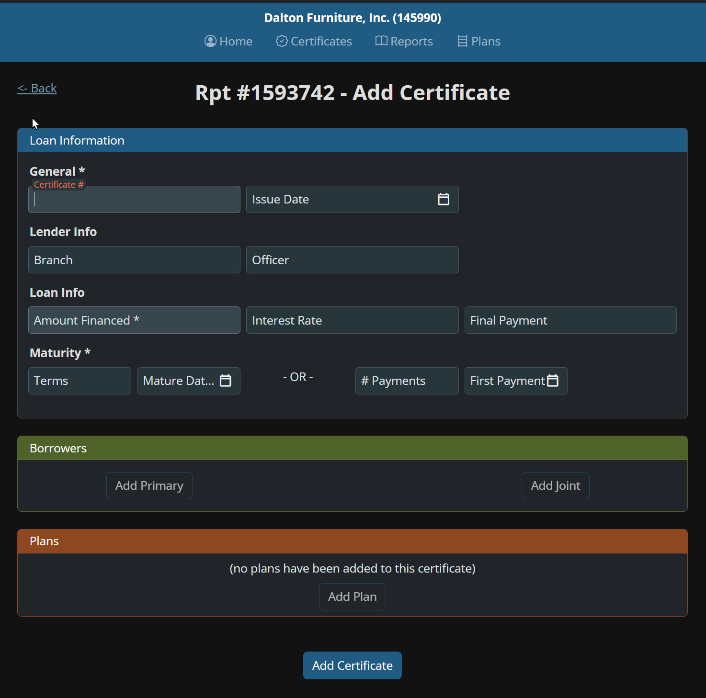
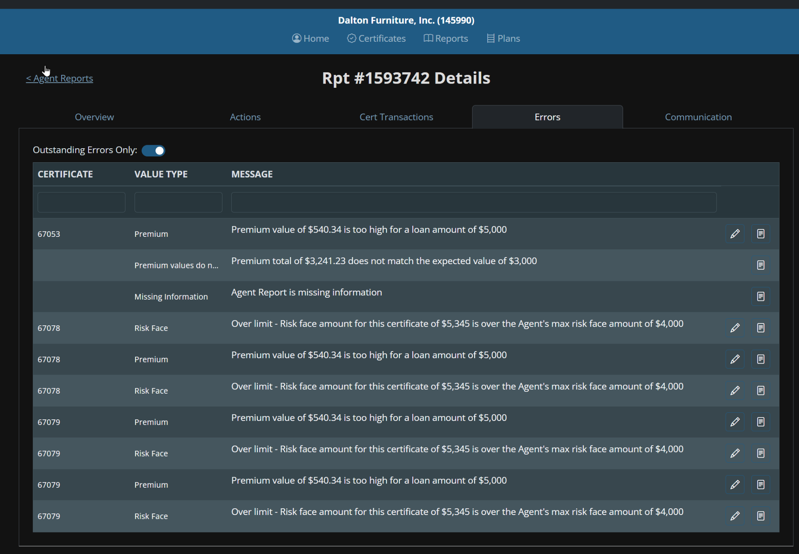
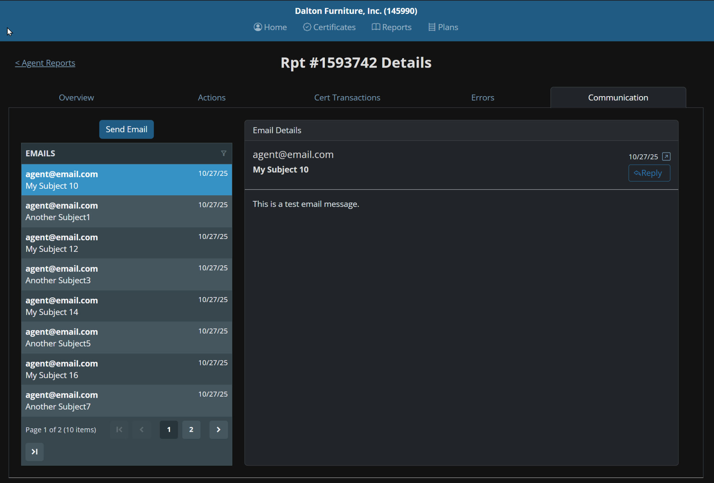

# TransCredit Prototype Overview - Interface Documentation

## 📋 Overview
This document contains detailed descriptions of all TransCredit prototype interfaces, demonstrating the transition from the outdated MS Access/Excel system to a modern web application with automated error processing and improved agent communication.

## 🏗️ System Architecture Overview

### Target Process Flow (Phase 1)


### Target Architecture (Phase 1)


---

# 1. Agent Reports Overview - Detailed Interface Description

## 📋 General Information
**Mockup File**: `01-Agent-Reports-Overview.svg`  
**Functionality**: Main page for managing agent reports  
**Target Audience**: TransCredit operational staff  
**Business Process**: Processing monthly reports from financial institutions

## 🖼️ Interface Preview
  

## 🎯 Interface Purpose
This interface serves as the central management point for agent reports, replacing the current MS Access system. It allows operational staff to view, analyze, and manage financial reports from banks and credit unions.

## 🧭 Navigation Structure

### Main Navigation (Top Panel)
- **Overview** - Report overview (current page)
- **Actions** - Report actions
- **Cert** - Certificate management
- **Transactions** - Financial transactions
- **Errors** - Error management
- **Communication** - Agent communication

## 📊 Report Information Section

### Report Header
- **Report Number**: Rpt #1593742
- **Description**: "August- Clarksdale"
  - Format: [Month] - [Agent City/Location]
  - Examples: "August Bath", "August ER", "August Upload"

### Main Report Fields
| Field | Value | Description | Business Logic |
|-------|-------|-------------|----------------|
| **Report Type** | Report Received (1) C List Report | Report type | Determines report source |
| **Created Date** | 9/5/25 | Creation date | Date when staff processed the report |
| **User** | jennifer.shannon | Responsible user | Who is processing the report |
| **Rpt Amount** | $2,286.69 | Report amount | Total amount agent owes |

### Financial Metrics
| Field | Value | Description | Calculation |
|-------|-------|-------------|-------------|
| **Certs Premium** | $5,210.72 | Total certificate premiums | Sum of all insurance premiums |
| **Certs Comm** | $2,924.04 | Agent commission | Percentage of premium agent receives |
| **Difference** | $0.01 | Calculation difference | Difference between expected and actual |

## 💰 Agent Transactions Section

### Section Header
- **Title**: "Agent Report Transactions"
- **Description**: "keep track of money posted to an Agent Report. Transactions can be added across RYMs as the data and funds are received and processed."

### Balancing Status
- **Status**: "Not Balanced, ($6.00)"
- **Indicator**: Red color (presumably)
- **Value**: Negative difference of $6.00

### Action Buttons
- **Add Transaction** - Add new transaction
- **E List Report** - Export transaction list

### Transactions Table
| Column | Description | Example Value |
|--------|-------------|---------------|
| **RYM** | Reporting Year Month | 202509 |
| **TYPE** | Transaction type | Report Received |
| **DESC** | Description | dev.user |
| **DATE** | Transaction date | 9/18/25, 12:43 PM |
| **AMOUNT** | Amount | $2,286.69 |

### Financial Summary
| Metric | Value | Description |
|--------|-------|-------------|
| **Trans Total** | $2,292.69 | Total of all transactions |
| **Report** | $2,286.69 | Report amount |
| **Difference** | ($6.00) | Difference (negative) |

## 🔧 Functional Capabilities

### Main Actions
1. **View Report** - Detailed financial status information
2. **Add Transactions** - Record agent payments
3. **Balancing** - Verify amount matching
4. **Navigation** - Transition to other report sections

### Business Rules
- **Mandatory Balancing**: Report cannot be completed without balance
- **Transaction Tracking**: All monetary receipts must be recorded
- **Time Frames**: Transactions can be added throughout the month (RYM)

## 🎨 Design and UX

### Visual Elements
- **Color Scheme**: Modern web palette
- **Typography**: Clear headers and readable text
- **Spacing**: Well-structured layout

### Interactivity
- **Clickable Elements**: Navigation tabs
- **Action Buttons**: Add Transaction, E List Report
- **Status Indicators**: Visual balance display

## 🔄 Integration with Other Modules

### Related Interfaces
- **Certificates** - Transition to certificate management
- **Errors** - View report errors
- **Communication** - Contact agent regarding balance issues

### Data
- **Source**: MS Access database (current system)
- **Target**: SQL Server (new system)
- **Format**: Structured report data

## 📈 Advantages of New Interface

### Compared to Current System (MS Access)
1. **Modern Interface** - Web application instead of Access forms
2. **Improved Navigation** - Intuitive tab structure
3. **Real-time** - Instant data updates
4. **Scalability** - Multiple user support

### Business Benefits
- **Processing Speed** - Quick access to information
- **Accuracy** - Automatic calculations and validation
- **Tracking** - Complete change history
- **Collaboration** - Multiple users

## 🚀 Technical Requirements

### Frontend
- **Technology**: Blazor WebAssembly
- **Responsive**: Adaptive design
- **Accessibility**: Compliance with accessibility standards

### Backend
- **API**: RESTful services
- **Database**: SQL Server
- **Authentication**: Integrated user system

### Integrations
- **Email System** - Status notifications
- **Financial Systems** - Transaction synchronization
- **Audit** - All action logging

---

# 2. Add Certificate Interface - Detailed Interface Description

## 📋 General Information
**Mockup File**: `02-Add-Certificate-Interface.svg`  
**Functionality**: Form for adding new insurance certificates  
**Target Audience**: TransCredit operational staff  
**Business Process**: Certificate data entry into the system

## 🖼️ Interface Preview
  

## 🎯 Interface Purpose
This interface replaces manual certificate data entry in MS Access. It allows staff to efficiently add new insurance certificates with built-in validation and structured data entry.

## 🧭 Navigation and Context

### Page Header
- **Back** - Return to previous page button
- **Rpt #1593742** - Report number (context)
- **Add Certificate** - Current operation name

### Contextual Information
- **Report**: #1593742 (August- Clarksdale)
- **User**: jennifer.shannon
- **Status**: Adding new certificate

## 📝 Form Structure

### 1. General Section
| Field | Type | Required | Description | Example |
|-------|------|----------|-------------|---------|
| **Certificate #** | Text | ✅ Required | Certificate number from agent | 67053 |

**Business Rules:**
- If certificate number is missing, use last 4 digits of SSN
- Uniqueness within report scope
- Format: numeric or alphanumeric

### 2. Lender Info Section
| Field | Type | Required | Description | Example |
|-------|------|----------|-------------|---------|
| **Branch** | Text | ❌ Optional | Bank/credit union branch | Main Branch |
| **Officer** | Text | ❌ Optional | Loan officer | John Smith |

**Business Rules:**
- Connection to agent (bank/credit union)
- Used for reporting and communication

### 3. Loan Info Section
| Field | Type | Required | Description | Example |
|-------|------|----------|-------------|---------|
| **Maturity** | Date/Number | ✅ Required | Maturity date or number of payments | 12/25/2026 |

**Business Rules:**
- Mutually exclusive fields: date OR number of payments
- Date cannot be in the past
- Maximum term: until customer's 71st birthday

### 4. Terms Section
| Field | Type | Required | Description | Example |
|-------|------|----------|-------------|---------|
| **Mature Date** | Date | ❌ Optional | Loan maturity date | 12/25/2026 |
| **# Payments** | Number | ❌ Optional | Number of payments | 36 |
| **First Payment** | Date | ❌ Optional | First payment date | 10/25/2023 |

**Business Rules:**
- Either maturity date or number of payments
- First payment cannot be in the past
- Relationship between payment count and maturity date

## 👥 Borrower Section

### Add Borrower Buttons
| Button | Function | Description |
|--------|----------|-------------|
| **Add Primary** | Add primary borrower | Primary borrower on the loan |
| **Add Joint** | Add joint borrower | Joint borrower (spouse) |

**Business Rules:**
- Minimum one borrower (Primary)
- Maximum two borrowers (Primary + Joint)
- Joint borrower only for family loans

## 📋 Insurance Plans Section

### Current State
- **Message**: "(no plans have been added to this certificate)"
- **Button**: **Add Plan** - Add insurance plan

### Insurance Plan Types
| Plan Type | Description | Required |
|-----------|-------------|----------|
| **Life Insurance** | Life insurance | ❌ Optional |
| **Disability Insurance** | Disability insurance | ❌ Optional |
| **AD&D Insurance** | Accidental death & dismemberment | ❌ Optional |

**Business Rules:**
- At least one plan must be added
- For Disability Insurance, health questions are mandatory
- Coverage limits depend on plan type and agent

## 🔧 Functional Capabilities

### Main Actions
1. **Data Entry** - Structured certificate information entry
2. **Validation** - Real-time data correctness checking
3. **Save** - Save certificate to system
4. **Navigation** - Return to report or proceed to next certificate

### Data Validation
- **Required Fields** - Check for mandatory field completion
- **Data Format** - Verify correct formats (dates, numbers)
- **Business Rules** - Check compliance with business logic
- **Duplication** - Verify certificate number uniqueness

## 🎨 Design and UX

### Visual Elements
- **Required Fields** - Marked with asterisk (*)
- **Sections** - Clear separation into logical groups
- **Buttons** - Intuitive action buttons
- **States** - Visual feedback during validation

### Interactivity
- **Dynamic Fields** - Show/hide fields based on selection
- **Real-time Validation** - Instant data checking
- **Auto-completion** - Suggestions based on previous entries

## 🔄 Integration with Other Modules

### Related Interfaces
- **Agent Reports Overview** - Return to report
- **Error Management** - Display validation errors
- **Certificate Search** - Search existing certificates

### Data
- **Source**: OCR-processed documents or manual entry
- **Target**: Certificate database
- **Format**: Structured certificate data

## 📈 Advantages of New Interface

### Compared to Current System (MS Access)
1. **Structured Entry** - Clear sections and fields
2. **Real-time Validation** - Instant data checking
3. **Improved UX** - Modern web interface
4. **Fewer Errors** - Built-in checks and constraints

### Business Benefits
- **Entry Speed** - Fast form completion
- **Data Accuracy** - Validation prevents errors
- **Standardization** - Uniform entry process
- **Tracking** - Change history and audit trail

## 🚀 Technical Requirements

### Frontend
- **Technology**: Blazor WebAssembly
- **Validation**: Client and server-side
- **Responsive**: Adaptive design for different devices

### Backend
- **API**: RESTful services for data saving
- **Database**: SQL Server with certificate tables
- **Validation**: Server-side business rules

### Integrations
- **OCR System** - Auto-fill from scanned documents
- **Error System** - Automatic validation error creation
- **Audit** - Logging all changes

## 🔍 Usage Examples

### Scenario 1: Adding Life Insurance Certificate
1. Enter certificate number: 67053
2. Select branch: Main Branch
3. Specify maturity date: 12/25/2026
4. Add primary borrower
5. Add Life Insurance plan
6. Save certificate

### Scenario 2: Certificate with Data Errors
1. Enter incorrect data
2. System shows validation errors
3. Correct errors
4. Re-validate
5. Save corrected certificate

---

# 3. Error Management System - Detailed Interface Description

## 📋 General Information
**Mockup File**: `03-Error-Management-System.svg`  
**Functionality**: System for managing and tracking certificate errors  
**Target Audience**: TransCredit operational staff  
**Business Process**: Automatic detection and correction of certificate data errors

## 🖼️ Interface Preview
  

## 🎯 Interface Purpose
This interface is a key automation component that replaces the manual "Run Snapshot" process from the current MS Access system. It allows staff to efficiently manage validation errors, track their status, and coordinate corrections with agents.

## 🧭 Navigation and Context

### Page Header
- **Navigation**: Agent Reports → Errors
- **Context**: Rpt #1593742 Details
- **Agent**: Dalton Furniture, Inc. (145990)

### Contextual Information
- **Report**: #1593742 (August- Clarksdale)
- **Agent**: Dalton Furniture, Inc. (ID: 145990)
- **Status**: Processing errors

## 🔍 Error Filtering and Management

### Filter Toggle
| Option | Description | Status |
|--------|-------------|--------|
| **Outstanding Errors Only** | Show only unresolved errors | ✅ Active |
| **All Errors** | Show all errors (including resolved) | ❌ Inactive |

**Functionality:**
- Toggle between viewing modes
- Filter by error status
- Improved performance with large error volumes

## 📊 Error Table

### Table Structure
| Column | Description | Example Values |
|--------|-------------|----------------|
| **CERTIFICATE** | Certificate number | 67053, 67078, 67079 |
| **VALUE TYPE** | Error type | Premium, Missing Information, Risk Face |
| **MESSAGE** | Detailed error description | Premium value of $540.34 is too high... |

### Examples of Certificates with Errors
- **67053** - One error type
- **67078** - Multiple errors (4 entries)
- **67079** - Multiple errors (4 entries)

## 🚨 Error Types in System

### 1. Premium Errors
| Error | Description | Business Logic |
|-------|-------------|----------------|
| **Premium Too High** | "Premium value of $540.34 is too high for a loan amount of $5,000" | Premium exceeds allowable percentage of loan amount |
| **Premium Mismatch** | "Premium total of $3,241.23 does not match the expected value of $3,000" | Mismatch between calculated and actual premium |

**Business Rules:**
- Premium cannot exceed established percentage of loan amount
- Calculations must match rate tables
- Verification of mathematical calculation correctness

### 2. Missing Information Errors
| Error | Description | Business Logic |
|-------|-------------|----------------|
| **Agent Report Missing Info** | "Agent Report is missing information" | Incomplete data in agent report |

**Business Rules:**
- All mandatory fields must be completed
- Data completeness check before processing
- Agent notification of missing information

### 3. Over Limit Errors
| Error | Description | Business Logic |
|-------|-------------|----------------|
| **Risk Face Over Limit** | "Over limit - Risk face amount for this certificate of $5,345 is over the Agent's max risk face amount of $4,000" | Exceeds agent's maximum coverage limit |

**Business Rules:**
- Each agent has maximum coverage limit per customer
- Check cumulative coverage across all active policies
- Agent confirmation or coverage adjustment required

## 🔧 Functional Capabilities

### Main Actions
1. **View Errors** - Detailed list of all certificate errors
2. **Filtering** - Show only unresolved errors
3. **Sorting** - Order by type, certificate, or priority
4. **Search** - Quick search by certificate number or error type

### Error Management
- **Error Status** - Track state (new, in progress, resolved)
- **Priority** - Determine error importance
- **Assignee** - Assign user for correction
- **Comments** - Add notes to errors

### Communication Integration
- **Agent Emails** - Automatic error list sending
- **Response Tracking** - Monitor agent corrections
- **Communication Status** - Track correction process

## 📈 Process Automation

### Automatic Error Detection
| Process | Current System | New System |
|---------|----------------|------------|
| **Start Check** | Manual "Run Snapshot" click | Automatic validation |
| **Check Frequency** | On demand | Real-time |
| **Error Types** | Limited set | Extended validation |

### Automatic Check Types
1. **Age Limits** - Check customer age compliance
2. **Premium Calculations** - Validate mathematical calculations
3. **Coverage Amounts** - Verify insurance amount correctness
4. **Refund Methods** - Validate pro-rata vs Rule 78
5. **Platform Errors** - Check agent system errors
6. **Printing Errors** - Detect extra premiums
7. **Limit Violations** - Check agent limit exceedances

## 🎨 Design and UX

### Visual Elements
- **Color Coding** - Different colors for different error types
- **Status Icons** - Visual error state indicators
- **Grouping** - Logical grouping by certificates
- **Progress Bars** - Display correction progress

### Interactivity
- **Clickable Rows** - Navigate to error details
- **Context Menus** - Quick error actions
- **Drag & Drop** - Move errors between statuses
- **Bulk Operations** - Select and process multiple errors

## 🔄 Integration with Other Modules

### Related Interfaces
- **Agent Reports Overview** - Report context
- **Add Certificate Interface** - Source of validation errors
- **Communication History** - Send agent notifications
- **Email Composition** - Create error emails

### Data
- **Source**: Automatic certificate validation
- **Target**: Error database and statuses
- **Format**: Structured error data

## 📈 Advantages of New System

### Compared to Current System (MS Access)
1. **Automation** - Eliminates manual "Run Snapshot" trigger
2. **Real-time** - Instant error detection
3. **Extended Validation** - More check types
4. **Improved Tracking** - Detailed error history

### Business Benefits
- **Time Reduction** - From 95% manual work to automation
- **Increased Accuracy** - Fewer missed errors
- **Improved Communication** - Structured agent notifications
- **Complete Audit** - Track all changes

## 🚀 Technical Requirements

### Frontend
- **Technology**: Blazor WebAssembly
- **Updates**: Real-time updates via SignalR
- **Filtering**: Client-side filtering for performance

### Backend
- **API**: RESTful services for error management
- **Database**: SQL Server with error tables
- **Validation**: Server-side business rules

### Integrations
- **Validation System** - Automatic error creation
- **Email System** - New error notifications
- **Audit** - Log all error actions

## 🔍 Usage Examples

### Scenario 1: Premium Error Detection
1. System automatically detects premium calculation error
2. Error appears in list with "Premium" type
3. Staff reviews error details
4. Email sent to agent with problem description
5. Agent corrects error and sends correction
6. Error marked as resolved

### Scenario 2: Agent Limit Exceedance
1. System checks customer's cumulative coverage
2. Agent limit exceedance detected
3. "Over Limit" error created
4. Staff contacts agent
5. Agent confirms or adjusts coverage
6. Error resolved after adjustment

---

# 4. Communication History - Detailed Interface Description

## 📋 General Information
**Mockup File**: `04-Communication-History.svg`  
**Functionality**: History of correspondence with agents regarding reports  
**Target Audience**: TransCredit operational staff  
**Business Process**: Tracking and managing agent communication

## 🖼️ Interface Preview
  

## 🎯 Interface Purpose
This interface solves a critical problem of the current system - lack of integrated communication tracking with agents. It replaces scattered email correspondence in email clients with a centralized communication management system.

## 🧭 Navigation and Context

### Page Header
- **Navigation**: Agent Reports → Communication
- **Context**: Rpt #1593742 Details
- **Section**: EMAILS

### Contextual Information
- **Report**: #1593742 (August- Clarksdale)
- **Agent**: Dalton Furniture, Inc. (ID: 145990)
- **Status**: Viewing communication history

## 📧 Email List

### Email List Structure
| Column | Description | Example Value |
|--------|-------------|---------------|
| **Sender** | Agent email address | agent@email.com |
| **Date** | Email send date | 10/27/25 |
| **Subject** | Email subject | My Subject 12, 14, 16 |

### Examples of Emails in History
| Date | Sender | Subject | Status |
|------|--------|---------|--------|
| 10/27/25 | agent@email.com | My Subject 12 | Read |
| 10/27/25 | agent@email.com | My Subject 14 | Read |
| 10/27/25 | agent@email.com | My Subject 16 | Read |

## 📄 Pagination and Navigation

### Pagination Information
- **Current Page**: Page 1 of 2
- **Total Items**: 10 items
- **Items per Page**: 5 emails

### Navigation Elements
| Element | Function | Description |
|---------|----------|-------------|
| **<** | Previous page | Go to previous page |
| **>** | Next page | Go to next page |
| **K** | Quick navigation | Go to specific page |

## 📖 Email Details

### Selected Email
| Field | Value | Description |
|-------|-------|-------------|
| **Sender** | agent@email.com | Agent email address |
| **Subject** | My Subject 10 | Email subject |
| **Date** | 10/27/25 | Send date |
| **Time** | 4 | Send time (presumably 4:00) |

### Email Content
- **Text**: "This is a test email message."
- **Type**: Test message
- **Status**: Read

### Action Buttons
| Button | Function | Description |
|--------|----------|-------------|
| **Reply** | Reply | Send response to agent |
| **Forward** | Forward | Forward email to another recipient |
| **Archive** | Archive | Move to archive |

## 🔧 Functional Capabilities

### Main Actions
1. **View History** - Complete correspondence history with agent
2. **Search Emails** - Search by subject, date, content
3. **Filter** - Filter by status, date, email type
4. **Sort** - Order by date, subject, status

### Email Management
- **Email Status** - Read/unread, important, archived
- **Tags** - Categorize emails by type (errors, confirmations, questions)
- **Attachments** - View and download attached files
- **Related Certificates** - Link emails to specific certificates

### Error Integration
- **Automatic Linking** - Emails automatically linked to errors
- **Contextual Information** - Display related errors in email
- **Correction Status** - Track error correction progress

## 📈 Process Automation

### Automatic Functions
| Function | Description | Benefit |
|----------|-------------|---------|
| **Automatic Categorization** | System determines email type | Quick sorting |
| **Error Linking** | Emails automatically linked to errors | Contextual information |
| **Notifications** | Notifications for new emails | Timely response |
| **Archiving** | Automatic archiving of old emails | Data organization |

### Email System Integration
- **Incoming Emails** - Automatic receipt from agents
- **Outgoing Emails** - Send emails through system
- **Synchronization** - Sync with mail servers
- **Backup** - Save all emails in database

## 🎨 Design and UX

### Visual Elements
- **Email List** - Clear structure with main information
- **Active Email Highlighting** - Visual highlighting of selected email
- **Status Indicators** - Icons for email status
- **Color Coding** - Different colors for different email types

### Interactivity
- **Clickable Rows** - Select email for viewing
- **Context Menus** - Quick email actions
- **Drag & Drop** - Move emails between folders
- **Keyboard Shortcuts** - Quick navigation

## 🔄 Integration with Other Modules

### Related Interfaces
- **Agent Reports Overview** - Report context
- **Error Management System** - Link to errors
- **Email Composition Interface** - Create new emails
- **Certificate Management** - Link to certificates

### Data
- **Source**: Email servers and manual entry
- **Target**: Communication database
- **Format**: Structured email data

## 📈 Advantages of New System

### Compared to Current System (Email Clients)
1. **Centralization** - All communication in one place
2. **Context** - Link emails to reports and errors
3. **Search** - Quick search through entire history
4. **Tracking** - Complete interaction history

### Business Benefits
- **Improved Communication** - Structured correspondence
- **Time Reduction** - Quick access to history
- **Quality Improvement** - Contextual information
- **Complete Audit** - Track all interactions

## 🚀 Technical Requirements

### Frontend
- **Technology**: Blazor WebAssembly
- **Updates**: Real-time updates via SignalR
- **Search**: Client-side search for quick access

### Backend
- **API**: RESTful services for email management
- **Database**: SQL Server with communication tables
- **Email Integration**: SMTP/POP3/IMAP protocols

### Integrations
- **Email Servers** - Sync with corporate email
- **Error System** - Automatic error linking
- **Audit** - Log all email actions

## 🔍 Usage Examples

### Scenario 1: View Error Correction History
1. Staff opens report with errors
2. Goes to Communication section
3. Views email history with agent
4. Finds email with error description
5. Checks agent response with corrections
6. Confirms receipt of corrections

### Scenario 2: Track Correction Progress
1. System sends email to agent with errors
2. Email appears in communication history
3. Agent responds with corrections
4. Response automatically linked to original email
5. Staff sees complete correspondence chain
6. Updates error status after receiving corrections

## 📊 Metrics and Analytics

### Key Metrics
- **Agent Response Time** - Average response time to emails
- **Email Count** - Statistics by agents and reports
- **Communication Status** - Percentage of resolved issues
- **Response Quality** - Completeness and accuracy of agent responses

### Reporting
- **Agent Reports** - Communication statistics by agents
- **Period Reports** - Communication analysis over time
- **Type Reports** - Email categorization and responses
- **Efficiency Reports** - Communication effectiveness analysis

---

# 5. Email Composition Interface - Detailed Interface Description

## 📋 General Information
**Mockup File**: `05-Email-Composition-Interface.svg`  
**Functionality**: Interface for creating and sending emails to agents  
**Target Audience**: TransCredit operational staff  
**Business Process**: Structured communication with agents regarding errors and questions

## 🖼️ Interface Preview
  

## 🎯 Interface Purpose
This interface replaces manual email creation in email clients with a structured communication system. It allows creating standardized emails with automatic inclusion of contextual information about errors and reports.

## 🧭 Navigation and Context

### Page Header
- **Navigation**: Agent Reports → Communication → Send Email
- **Context**: Rpt #1593742 Details
- **Section**: Communication

### Contextual Information
- **Report**: #1593742 (August- Clarksdale)
- **Agent**: Dalton Furniture, Inc. (ID: 145990)
- **Status**: Creating email to agent

## 📧 Email Creation Form

### Main Email Fields
| Field | Value | Description | Required |
|-------|-------|-------------|----------|
| **To** | test@email.com | Primary recipient (agent) | ✅ Required |
| **Cc** | "Add any additional email addresses here" | Additional recipients | ❌ Optional |
| **Subject** | "RPT#1593742 - Report Correction Request" | Email subject | ✅ Required |

### Auto-fill Features
- **Report Number** - Automatically included in email subject
- **Request Type** - Standardized subjects (Correction Request, Information Request, etc.)
- **Agent Email** - Auto-fill from agent database

## 📎 Document Inclusion Options

### Checkboxes for Including Files
| Option | Status | Description | Content |
|--------|--------|-------------|---------|
| **Include Cert Errors spreadsheet?** | ☑ Checked | Include certificate errors table | Excel file with detailed error list |
| **Include R-List?** | ☑ Checked | Include R-List report | Report with financial data |

### Automatically Generated Documents
- **Cert Errors Spreadsheet** - Detailed table of all certificate errors
- **R-List Report** - Financial report with amounts and calculations
- **Certificate Details** - Detailed information on problematic certificates

## 📎 Attachment Management

### Attachments Section
| Element | Description | Function |
|---------|-------------|----------|
| **Attachments** | "(none)" | Current attachments |
| **+ Attachment** | Add button | Add file manually |

### Attachment Types
- **Automatic** - System-generated documents
- **Manual** - User-uploaded files
- **Templates** - Standard documents for different request types

## 🔧 Functional Capabilities

### Main Actions
1. **Create Email** - Structured message creation
2. **Auto-fill** - Pre-fill fields from context
3. **Include Documents** - Automatically add reports
4. **Send** - Send email to agent

### Email Templates
| Email Type | Description | Auto Content |
|------------|-------------|--------------|
| **Correction Request** | Request for error corrections | Error list, instructions |
| **Information Request** | Request for additional information | Missing data list |
| **Confirmation** | Confirmation of data receipt | Processing confirmation |
| **Follow-up** | Reminder about unresolved issues | Open questions list |

### Validation and Checks
- **Required Fields** - Check completion of main fields
- **Email Validation** - Verify email address correctness
- **Attachment Size** - Check attached file sizes
- **Content** - Verify presence of necessary information

## 📈 Process Automation

### Automatic Functions
| Function | Description | Benefit |
|----------|-------------|---------|
| **Subject Generation** | Automatic email subject creation | Communication standardization |
| **Error Inclusion** | Automatic error list addition | Information completeness |
| **Templates** | Pre-set email templates | Consistency |
| **Tracking** | Automatic sent email tracking | Complete audit |

### Error System Integration
- **Automatic Inclusion** - Errors automatically included in email
- **Contextual Information** - Error details with certificate numbers
- **Instructions** - Automatic correction instructions
- **Deadlines** - Specify correction timeframes

## 🎨 Design and UX

### Visual Elements
- **Clear Structure** - Logical section separation
- **Intuitive Elements** - Understandable buttons and fields
- **Status Indicators** - Visual feedback
- **Preview** - Pre-send preview capability

### Interactivity
- **Dynamic Fields** - Show/hide fields based on selection
- **Auto-completion** - Suggestions based on previous emails
- **Drag & Drop** - Drag files for attachments
- **Keyboard Shortcuts** - Quick actions

## 🔄 Integration with Other Modules

### Related Interfaces
- **Agent Reports Overview** - Report context
- **Error Management System** - Source of errors to include
- **Communication History** - Save sent emails
- **Certificate Management** - Link to certificates

### Data
- **Source**: Report and error data
- **Target**: Email servers and communication database
- **Format**: Structured email data

## 📈 Advantages of New System

### Compared to Current System (Email Clients)
1. **Standardization** - Uniform emails with templates
2. **Automation** - Automatic contextual information inclusion
3. **Integration** - Link to error and report systems
4. **Tracking** - Complete sent email history

### Business Benefits
- **Consistency** - Standardized communication
- **Completeness** - Automatic inclusion of all necessary information
- **Efficiency** - Quick professional email creation
- **Audit** - Complete communication tracking

## 🚀 Technical Requirements

### Frontend
- **Technology**: Blazor WebAssembly
- **Editor** - Rich text editor for formatting
- **Validation** - Client-side form validation
- **Preview** - WYSIWYG editor

### Backend
- **API**: RESTful services for email sending
- **Email Server** - SMTP server for sending
- **Document Generation** - Create Excel/PDF reports
- **Templates** - Email template system

### Integrations
- **Email Servers** - Corporate SMTP servers
- **Error System** - Automatic error inclusion
- **Database** - Save email history
- **File System** - Attachment management

## 🔍 Usage Examples

### Scenario 1: Send Error Correction Request
1. Staff opens report with errors
2. Goes to Communication section
3. Clicks "Send Email"
4. System auto-fills subject: "RPT#1593742 - Report Correction Request"
5. Checks "Include Cert Errors spreadsheet?"
6. Adds additional instructions
7. Sends email to agent

### Scenario 2: Request Additional Information
1. Staff discovers missing information
2. Creates new email with subject "Information Request"
3. System automatically includes missing data list
4. Adds completion instructions
5. Sends email to agent

## 📊 Email Templates

### Standard Templates
| Template | Subject | Content | Attachments |
|----------|---------|---------|-------------|
| **Correction Request** | RPT#[number] - Report Correction Request | Error list, correction instructions | Cert Errors spreadsheet |
| **Information Request** | RPT#[number] - Missing Information Request | Missing data list | R-List report |
| **Confirmation** | RPT#[number] - Report Received Confirmation | Receipt confirmation | None |
| **Follow-up** | RPT#[number] - Follow-up Required | Reminder about unresolved issues | Previous correspondence |

### Template Customization
- **Personalization** - Add agent name
- **Contextual Information** - Include specific details
- **Instructions** - Detailed correction instructions
- **Deadlines** - Specify timeframes

---

# System Workflow Overview

## 🔄 Interface Integration Flow

```
Agent Reports Overview
         ↓
Add Certificate Interface
         ↓
Error Management System
         ↓
Communication History ← → Email Composition Interface
```

## 🎯 Key System Benefits

### Operational Efficiency
- **Error Automation**: 95% manual work → automation
- **Processing Speed**: Quick access to information
- **Data Accuracy**: Built-in validation
- **Standardization**: Uniform processes

### Agent Communication
- **Centralization**: All correspondence in one place
- **Structure**: Standardized emails
- **Tracking**: Complete interaction history
- **Context**: Linking emails to reports and errors

### Technology Modernization
- **Modern Platform**: Blazor WebAssembly
- **Scalability**: SQL Server backend
- **Integrations**: Email, OCR, file systems
- **Future Development**: Growth foundation

---

*This comprehensive document is intended for analysts, project managers, and developers to understand the complete functionality of all TransCredit prototype interfaces.*
